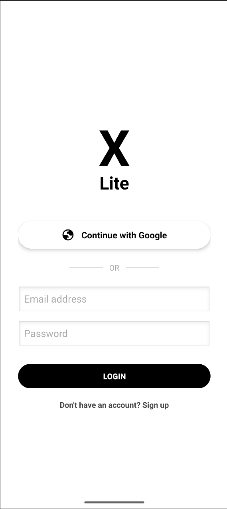
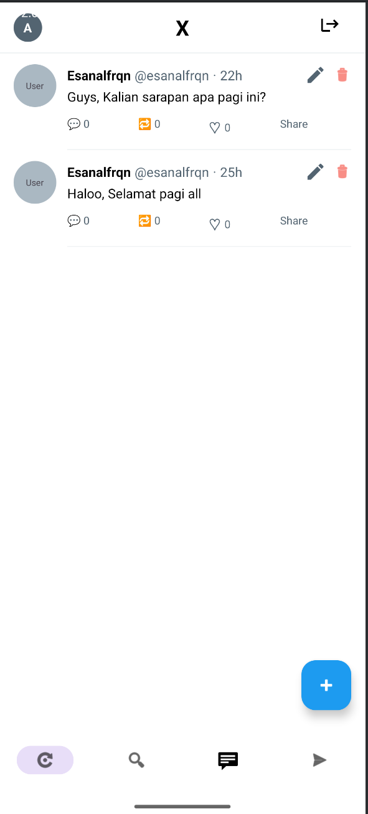
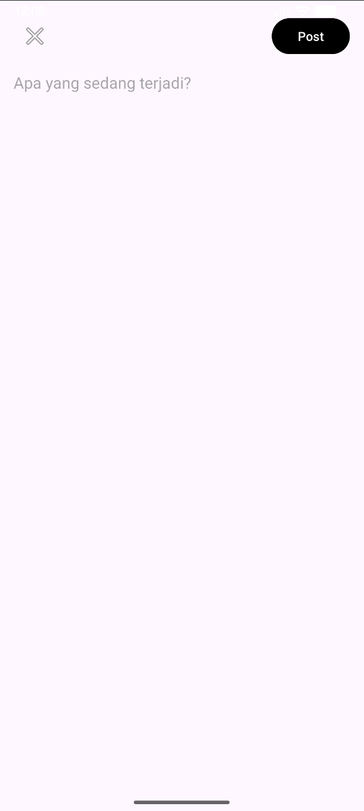
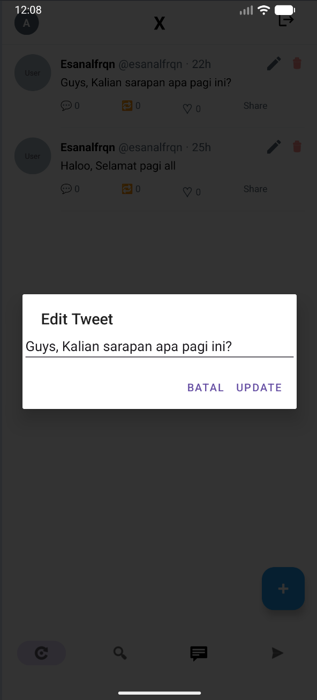
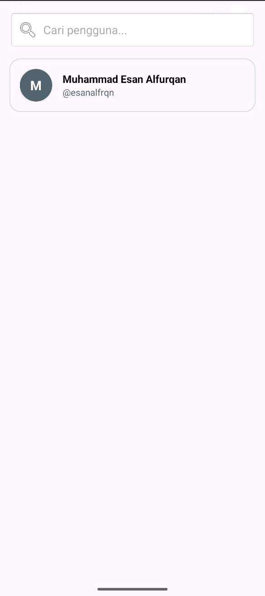
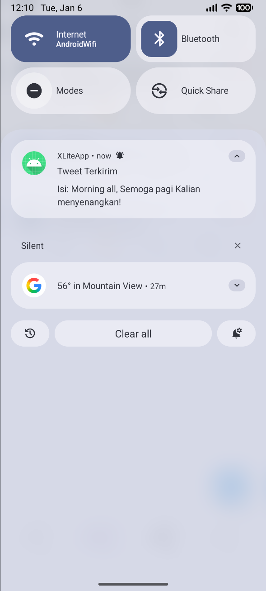

# XLiteApp - Social Media App (Twitter/X Clone)

Aplikasi mobile Android berbasis Kotlin yang mereplikasi fitur dasar media sosial Twitter/X. Proyek ini dibuat untuk memenuhi Tugas Besar/Ujian Akhir Semester Mata Kuliah Aplikasi Mobile 2.

## 👤 Identitas Pengembang
* **Nama:** [Muhammad Esan Alfurqan]
* **NIM:** [2304411478]
* **Nama:** [Andini]
* **NIM:** [2304411077]
* **Kelas:** [5K RPL 3]
* **Prodi:** Informatika - Universitas Cokroaminoto Palopo

## 📱 Tentang Aplikasi
* **Nama Aplikasi:** XLiteApp
* **Aplikasi Rujukan:** X (Twitter) - [Link Play Store](https://play.google.com/store/apps/details?id=com.twitter.android)
* **Deskripsi:** Aplikasi ini memungkinkan pengguna untuk memposting status (tweet), melihat timeline, mencari pengguna lain, serta mengedit dan menghapus postingan sendiri secara real-time.

## 🛠️ Teknologi & Tools
* **Bahasa Pemrograman:** Kotlin
* **IDE:** Android Studio Ladybug/Koala
* **Database:** Firebase Realtime Database
* **Authentication:** Firebase Auth (Email/Pass & Google Sign-In)
* **Arsitektur:** MVC (Model-View-Controller)

## ✅ Fitur Aplikasi (Checklist Ujian)
Aplikasi ini telah memenuhi kriteria soal ujian sebagai berikut:

- [x] **Otentikasi Firebase (2 Metode)**
    - Login & Register menggunakan Email/Password.
    - Login menggunakan Google Sign-In.
- [x] **Database Realtime (CRUD)**
    - **Create:** Membuat postingan tweet baru.
    - **Read:** Menampilkan daftar tweet di halaman utama (Home).
    - **Update:** Mengedit isi tweet (hanya pemilik tweet).
    - **Delete:** Menghapus tweet (hanya pemilik tweet).
- [x] **Implementasi Komponen Android**
    - **Fragment:** Digunakan pada fitur Pencarian (SearchFragment).
    - **Intent:** Navigasi antar halaman (Login -> Home -> Post).
    - **RecyclerView:** Menampilkan list tweet dan list pengguna.
- [x] **Notifikasi**
    - Notifikasi lokal muncul di status bar ketika pengguna berhasil memposting tweet baru.

## 📸 Screenshots
Berikut adalah tangkapan layar dari aplikasi:

|        Login / Register         |     Halaman Utama (List)      |      Tambah Data (Add)      |
|:-------------------------------:|:-----------------------------:|:---------------------------:|
|  |  |  |
|      *(Screenshot Login)*       |   *(Screenshot List Tweet)*   |  *(Screenshot Buat Tweet)*  |

|           Edit Data           |          Detail / Search          |              Notifikasi              |
|:-----------------------------:|:---------------------------------:|:------------------------------------:|
|  |  |  |
|  *(Screenshot Edit Dialog)*   |     *(Screenshot Pencarian)*      |      *(Screenshot Notifikasi)*       |

*(Catatan: Gambar screenshot disimpan dalam folder 'screenshots' di repository ini)*

## 🚀 Cara Menjalankan Aplikasi
1.  Clone repository ini:
    ```bash
    git clone https://github.com/Sann291/XLiteApp.git
    ```
2.  Buka project menggunakan **Android Studio**.
3.  Pastikan file `google-services.json` sudah terhubung dengan akun Firebase Anda (atau gunakan file yang sudah disertakan jika public).
4.  Tunggu proses Gradle Sync selesai.
5.  Jalankan aplikasi (Run 'app') pada Emulator atau Perangkat Fisik.

---
**Copyright © 2026 [Muhammad Esan Alfurqan]. All Rights Reserved.**
